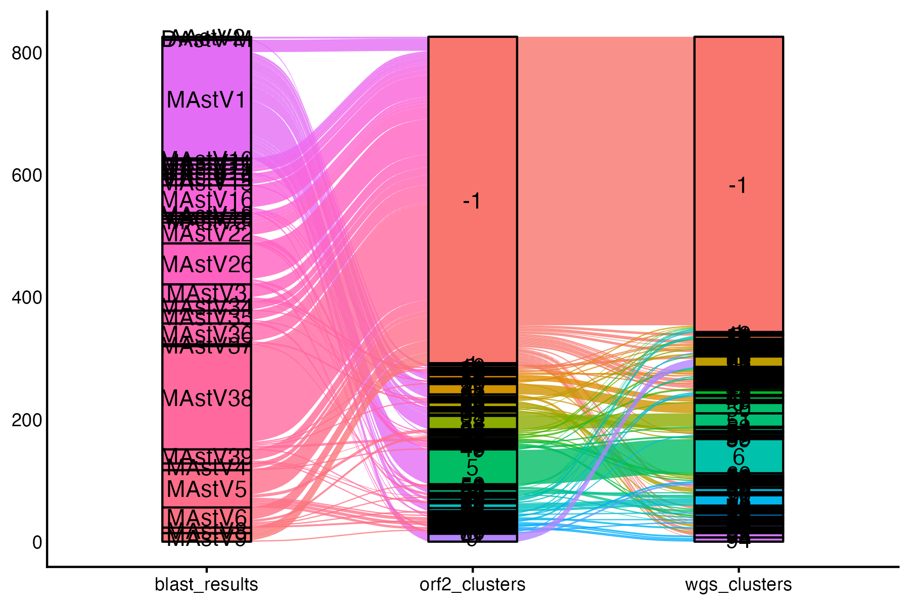
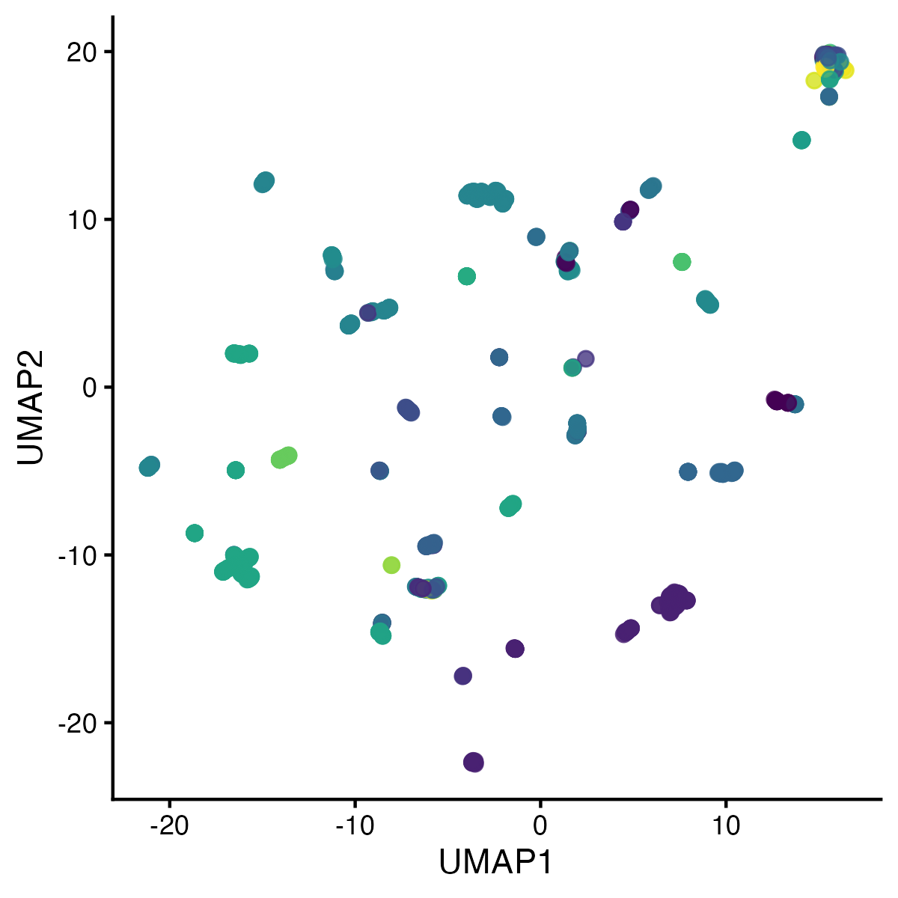

# fasta-cluster

A modular workflow for taking a set of sequences and clustering them into representative sequences

## Usage

```
nextflow run fasta-cluster \
  --fasta sequences.fasta \
  --samplesheet [samplesheet.csv] \
  --min_similarity '80.0' \
  --outdir "cluster-results" \
  --cluster_by mmseq,mash,fastani \ # Aspirational, not working yet
  --segments "WGS" \
  -profile stjude
```

## Optional: Alluvial plots to compare various clustering methods

```bash
# General format of the script (remember to drop the comments, or command does not work)
Rscript bin/alluvial.R \
  SequenceName \   #<= One ID to combine cluster files
  mmseq_cluster.tsv fastani_cluster.tsv mash_cluster.tsv # <= An abitrary number of cluster files, must have a ClusterNumber column

# Generates an alluvial plot in the order that the cluster files are passed in
open alluvial.png
```

Example:




## Optional: UMAP plots to plot distance and cluster

```bash
# General format of the script (remember to drop the comments, or command does not work)
Rscript bin/umap.R \
  distance.tsv \  # node1, node2, dist
  metadata.tsv \  # Clusters or other attributes
  id_col       \  # node1 matches to which column in metadata
  color_by        # cluster or other column to color by

# Generates a umap with and without color legend
open umap.png umap_legend.png
```

Example:

